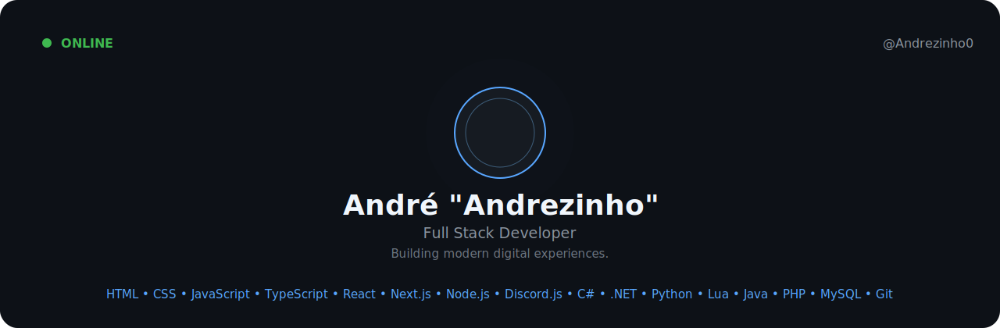

  

  

  Building modern digital experiences with a passion for performance, clean architecture and great user experiences.

  

## About Me

I'm André Almeida, a Brazilian Full Stack Developer passionate about building modern applications with a strong focus on performance, scalability and clean architecture.

I enjoy turning ideas into polished digital products, from modern frontends to robust backend systems, always striving for clean, maintainable and high-quality code.

- 🇧🇷 Based in Brazil
- 💼 Full Stack Developer
- 🤖 Discord Developer
- 🚀 Building premium digital experiences

  

## Tech Stack

  

  

## Currently

- 🚀 Building premium digital experiences
- ⚙️ Developing scalable backend systems
- 🤖 Creating Discord applications
- 📚 Learning something new every day

  

## GitHub Stats

  
  

  

## Website

  <a href="https://andrezinho.site">🌐 andrezinho.site</a>

  

  <strong>Design × Development × Innovation</strong>

